# ПЕТ-ПРОЕКТ

Проект написанный с использованием мною написанного фреймворка.

___

Функционал:
+ регистрация;
+ авторизация;
+ добавление, удаление, изменения данных пользователя;
+ библиотеки:
  + отправка почты с помощью библиотеки [PHPMailer](https://packagist.org/packages/phpmailer/phpmailer);
  + [RedBeanPHP](https://packagist.org/packages/gabordemooij/redbean) для работы с базой данных;
  + [Bootstrap](https://packagist.org/packages/twbs/bootstrap) для реализации пагинации в панели администратора.
+ паттерны:
  + Registry;
  + SingleTon.
___

<details><summary><b>Скриншоты проекта</b></summary>

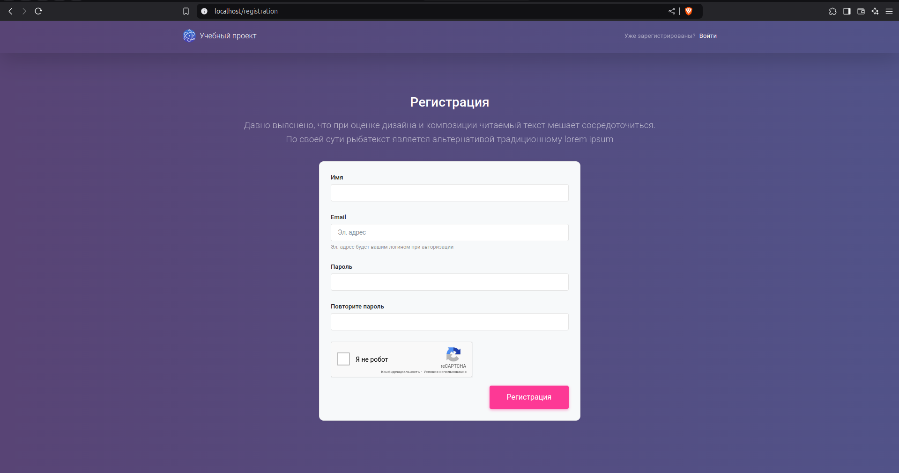 | **Register** |

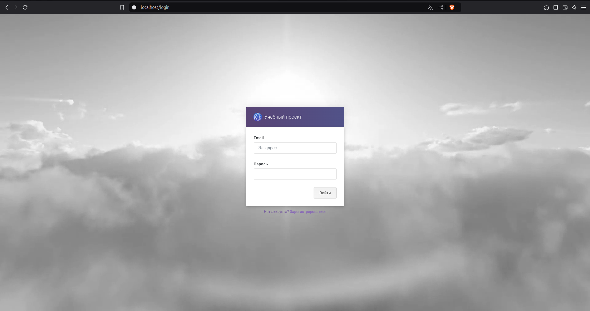 | **Login** |

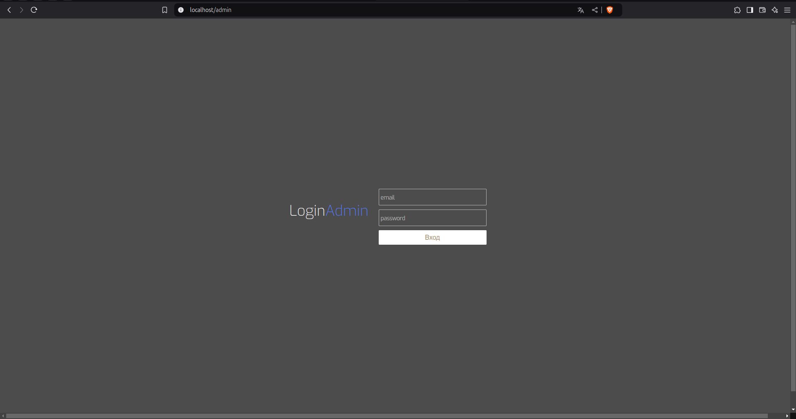 | **Auth admin** |

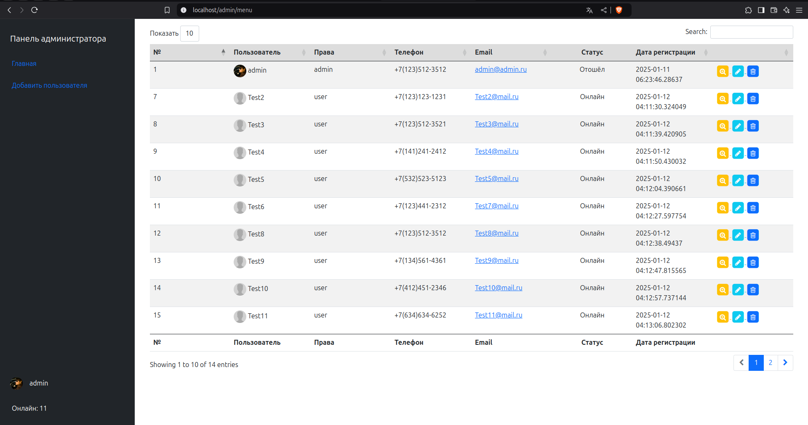 | **Admin panel** |

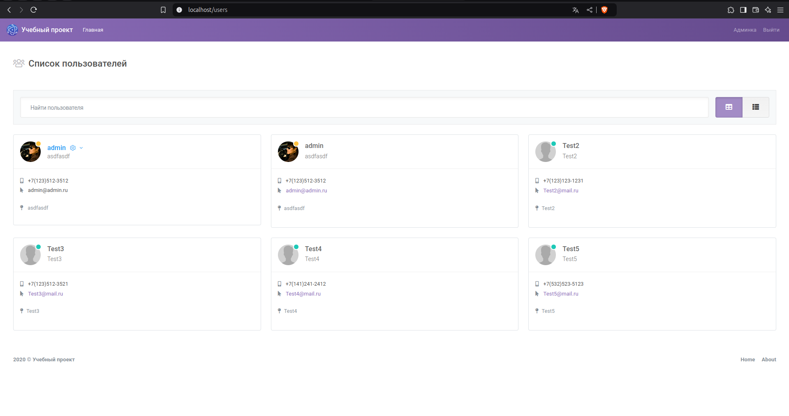 | **Main page** |

 | **Main page** |

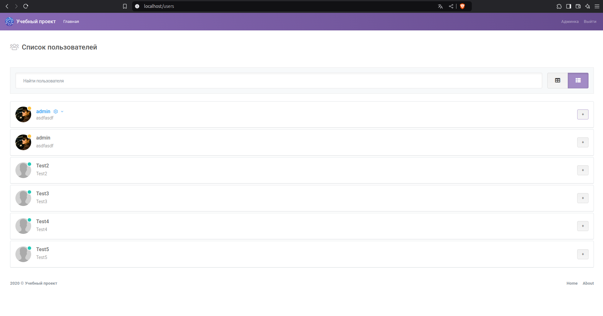 | **Main page2** | 

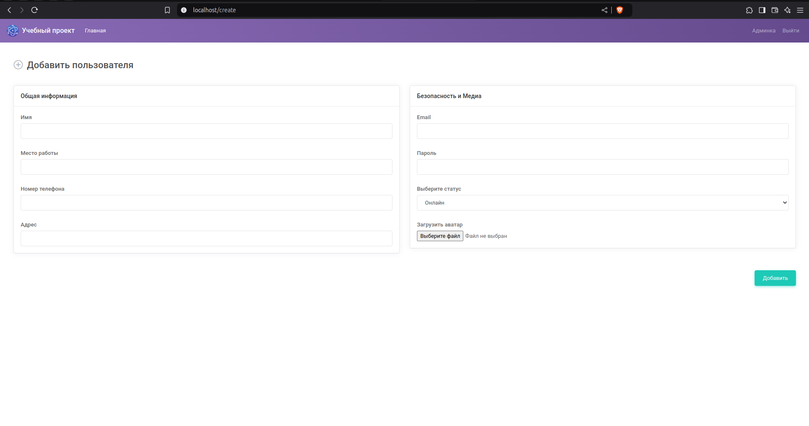 | **Create user** | 

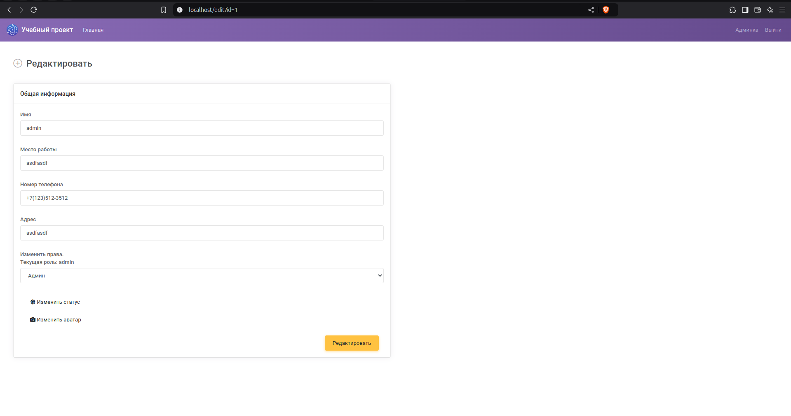 | **Edit user** | 

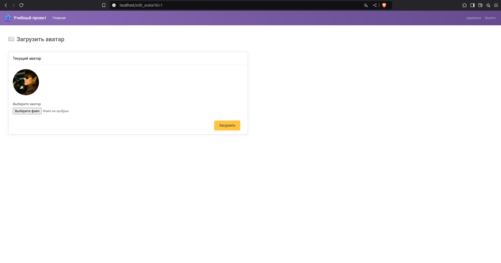 | **Edit avatar** | 

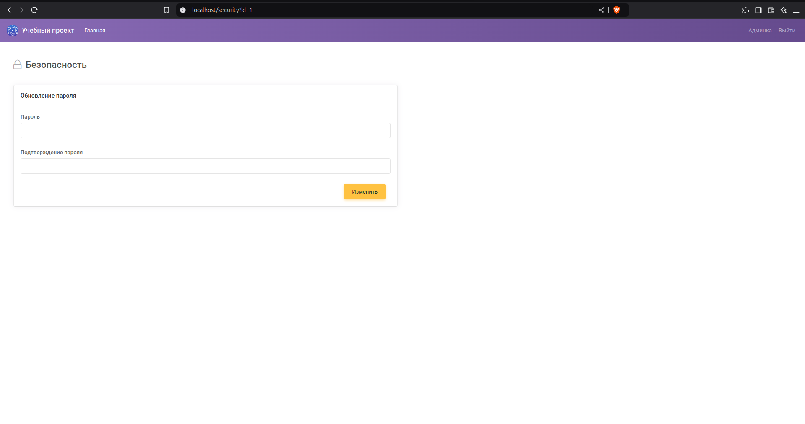 | **Edit password** |

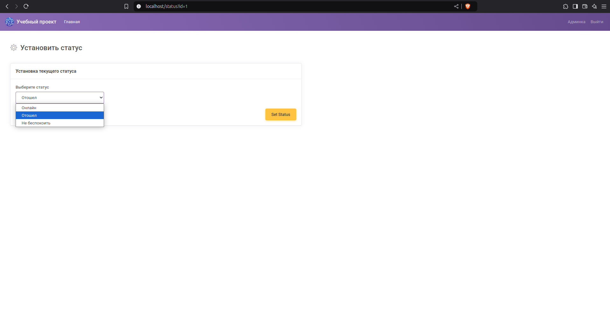 | **Edit status** |

</details>

___

# Настройка

## Чтобы собрать проект Composer:

Git clone
  + `git clone git@github.com:GlebGS/petProject_MyFramework-Site.git`   

Composer
  + `composer install`
  + `composer update`
  + `composer dump-autoload`

## Если используешь NGINX

```nginx
    events {}

    http {

        include mime.types;
        
        server {
            listen 80;
            listen [::]:80;
            server_name pet_project.com;
            root /home/sites/pet_project/Public;
            
            index index.php;
        
            charset utf-8;
        
            location / {
                try_files $uri $uri/ /index.php?$query_string;
            }
        
            error_page 404 /index.php;
        
            location ~ ^/index\.php(/|$) {
                fastcgi_param SCRIPT_FILENAME $realpath_root$fastcgi_script_name;
                include fastcgi_params;
                fastcgi_hide_header X-Powered-By;
                
                fastcgi_pass 127.0.0.1:9000;
            }
        
            location ~ /\.(?!well-known).* {
                deny all;
            }
        }	
        
    }
```

## Если используешь APACHE

### /.htaccess
```apache
    RewriteEngine On
    RewriteRule (.*) Public/$1
```

### Public/.htaccess
```apache
    RewriteEngine On
    RewriteCond %{REQUEST_FILENAME} !-f
    #RewriteCond %{REQUEST_FILENAME} !-d
    RewriteRule (.*) index.php?$1 [L,QSA]

    #Options -Indexes
```

## Подключение к базе данных

Параметры базы данных находятся в файле `/Config/env.php`

## SQL Создание таблицы 
```sql
CREATE TABLE "users"(
        id SERIAL NOT NULL,
        name VARCHAR(32),
        role VARCHAR(12) DEFAULT 'user',
        email VARCHAR(32) NOT NULL,
        password VARCHAR(128) NOT NULL,
        "date" timestamp without time zone NOT NULL DEFAULT CURRENT_TIMESTAMP,
        PRIMARY KEY(id)
    );

    CREATE TABLE "data"(
        id SERIAL NOT NULL,
        "user_id" integer,
        work varchar(128) DEFAULT NULL,
        phone varchar(128) DEFAULT NULL,
        address varchar(128) DEFAULT NULL,
        status VARCHAR(32) DEFAULT 'danger',
        avatar varchar(128) DEFAULT '/img/avatar/default.png',
        "date" timestamp without time zone NOT NULL DEFAULT CURRENT_TIMESTAMP,
        PRIMARY KEY(id)
    );

    CREATE INDEX index_foreignkey_data_users ON "data" USING btree ("user_id");
```

## Настройка reCAPTCHA

- Создайте [reCAPTCHA](https://www.google.com/recaptcha/about/) и скопируйте ключ:
- После чего вставьте в `data-sitekey="6LeMzbYqAAAAAOP4VClHvrmIW7mjuV_pTQ5fXVMY">` в файле [page_register.php](App/View/page_register.php)

<details><summary><b>Скриншот reCaptcha</b></summary>

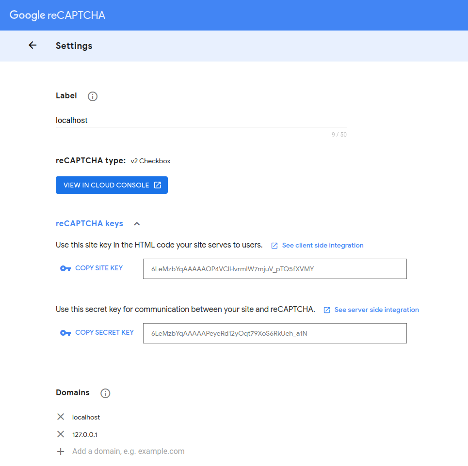

</details>


